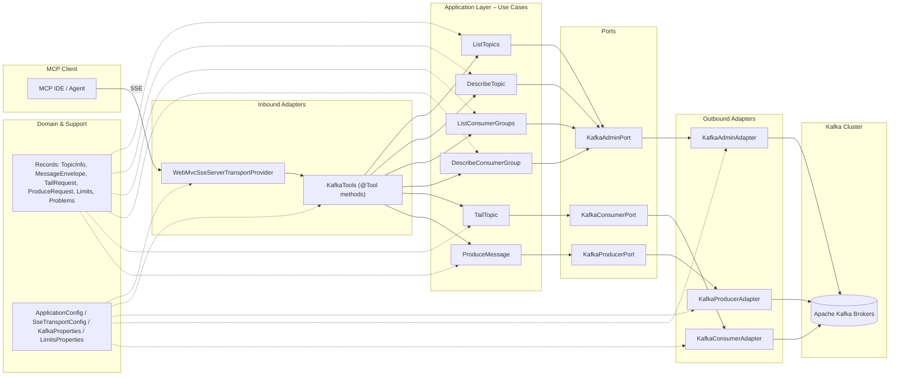

# Kafka MCP Server

Spring Boot 3.3 / Java 21 MCP server that exposes Kafka read/produce tooling over the Spring AI MCP STDIO transport and an HTTP SSE endpoint. The app follows a hexagonal layout (`domain`, `ports`, `application`, `adapters`) and relies on Kafka clients plus Testcontainers for end-to-end verification.

## Available MCP Tools

| Tool                                                 | Description                                                                                              |
|------------------------------------------------------|----------------------------------------------------------------------------------------------------------|
| `listTopics(prefix?, suffix?)`                       | Lists topics (internal ones included) and basic stats. Can filter by prefix OR suffix (not both). Use suffix filtering to find DLT topics (e.g., `suffix="-dlt"`). |
| `describeTopic({topic})`                             | Returns partition metadata with leader, replicas, and ISR IDs.                                           |
| `produceMessage({topic,format,key?,headers?,value})` | Validates payload size/format and produces via Kafka.                                                    |
| `tailTopic({topic,from,limit?,partition?})`          | Tails messages from `earliest`, `latest`, `end-N`, `offset:X`, or `timestamp:T` positions. Messages from multiple partitions are merged and sorted by timestamp. Adds JSON parsing when possible. |
| `listConsumerGroups(prefix?)`                        | Lists consumer groups, states, and members.                                                              |
| `describeConsumerGroup({groupId})`                   | Shows detailed consumer group information including partition assignments, current offsets, end offsets, and lag calculation for each partition. |

Each invocation is logged with `tool_call` structured logs and measured via Micrometer timers/counters (`kafka_mcp_*` metrics). Attach the Prometheus registry (already on the classpath) to scrape these metrics in production.

### Usage Examples

**List all topics:**
```json
{"prefix": null, "suffix": null}
```

**Find topics by prefix:**
```json
{"prefix": "orders-", "suffix": null}
```
Returns: `orders-v1`, `orders-v2`, `orders-retry`, etc.

**Find DLT (Dead Letter Topic) topics by suffix:**
```json
{"prefix": null, "suffix": "-dlt"}
```
Returns: `orders-dlt`, `payments-dlt`, `notifications-dlt`, etc.

**Find retry topics:**
```json
{"prefix": null, "suffix": "-retry"}
```

> **Note:** You cannot use both `prefix` and `suffix` at the same time. The server will return an error if both are provided.

## Architecture

The project follows hexagonal architecture (ports and adapters) to keep business logic independent from external concerns.




### Layer Responsibilities

- **Domain Layer**: Pure business logic, immutable data models (records), no external dependencies
- **Ports**: Interfaces defining contracts between application and adapters
- **Application Layer**: Use cases orchestrating business operations, enforcing limits and validation
- **Adapters (Inbound)**: MCP tool exposure via Spring AI annotations
- **Adapters (Outbound)**: Kafka client implementations (AdminClient, Consumer, Producer)
- **Configuration**: Spring Boot wiring, properties management, bean definitions

## Getting Started

### Prerequisites
- JDK 21
- Docker (only needed when running the Testcontainers-based integration suite)
- A Kafka cluster (or local broker) reachable via `KAFKA_BOOTSTRAP_SERVERS`

### Configuration
All settings live in `src/main/resources/application.yaml`. Override the important ones via environment variables:

| Property                 | Env Var                   | Default          |
|--------------------------|---------------------------|------------------|
| `kafka.bootstrapServers` | `KAFKA_BOOTSTRAP_SERVERS` | `localhost:9092` |
| `limits.messagesPerCall` | `LIMIT_MESSAGES_PER_CALL` | `200`            |
| `limits.bytesPerCall`    | `LIMIT_BYTES_PER_CALL`    | `1048576`        |
| `limits.messageBytes`    | `LIMIT_MESSAGE_BYTES`     | `262144`         |
| `server.port`            | `SERVER_PORT`             | `8080`           |
| `spring.ai.mcp.server.stdio` | n/a | `false` (enables SSE) |
| `spring.ai.mcp.server.base-url` | `MCP_BASE_URL` | `http://localhost:8080` |
| `management.endpoints.web.exposure.include` | n/a | `prometheus,health,info` |

### Run the MCP Server
```bash
./mvnw spring-boot:run \
  -Dspring-boot.run.jvmArguments="-Dspring.main.lazy-initialization=false"
```
- Spring AI currently supports one MCP transport per process; this project ships with the **HTTP SSE transport** enabled (`spring.ai.mcp.server.stdio=false`). To switch back to STDIO, set `spring.ai.mcp.server.stdio=true` and disable/remove the SSE-specific properties.
- HTTP MCP clients should open an SSE stream to `http://localhost:${SERVER_PORT:-8080}/sse` and POST MCP requests to `http://localhost:${SERVER_PORT:-8080}/mcp/message` (both endpoints are configurable via `spring.ai.mcp.server.sse-*` properties).

On startup you’ll see a `mcp_server_ready` log line with the effective limits, bootstrap servers, and MCP metadata.

### Build & Run via Docker
An optimized multi-stage `Dockerfile` is available at the repo root. Build and run it like so:

```bash
docker build -t kafka-mcp .
docker run --rm -p 8080:8080 \
  -e KAFKA_BOOTSTRAP_SERVERS=host.docker.internal:29092 \
  kafka-mcp
```

Add `-e MCP_BASE_URL` or other environment overrides as needed. The container exposes port `8080` by default and runs as an unprivileged user.

#### Native Image Variant
For smaller images and faster start-up you can build the GraalVM native image container:

```bash
docker build -f Dockerfile.native -t kafka-mcp-native .
docker run --rm -p 8080:8080 \
  -e KAFKA_BOOTSTRAP_SERVERS=host.docker.internal:29092 \
  kafka-mcp-native
```

This uses GraalVM’s `native-maven-plugin` (activated via `-Pnative`) and can take several minutes plus a few gigabytes of RAM during compilation.

### Metrics

The Prometheus registry is on the classpath and exposed through Spring Boot Actuator. Once the app is running you can scrape:

```
http://localhost:${SERVER_PORT:-8080}/actuator/prometheus
```

Metrics are emitted per MCP tool (`kafka_mcp_*`) and include durations, counts, bytes, and error tallies.

## Testing

- **Unit tests only:** `./mvnw test -DskipITs=true`
- **Full verification (includes Testcontainers Kafka):** `./mvnw clean verify` (runs unit tests via Surefire and `@Tag("integration")` tests via Failsafe)

The integration suite spins up Kafka in Docker and covers produce/tail/describe happy paths. Make sure Docker is running before executing the full verify command; Failsafe will automatically pick up the tagged tests during the `verify` phase.

## Development Notes
- Keep the hexagonal boundaries intact: business rules live in `application` and `domain`, while adapters wrap Kafka and MCP transport concerns.
- Constructor injection only; prefer immutable records (`record`) for data contracts.
- Do not hard-code credentials or bootstrap servers—always reference configuration properties.
- When introducing new tools or Kafka capabilities, amend `plan.md` and expand the Testcontainers coverage accordingly.
