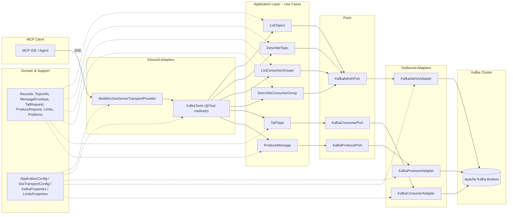

# Kafka MCP Server

Spring Boot 3.3 / Java 21 MCP server that exposes Kafka read/produce tooling over the Spring AI MCP STDIO transport and an HTTP SSE endpoint. The app follows a hexagonal layout (`domain`, `ports`, `application`, `adapters`) and relies on Kafka clients plus Testcontainers for end-to-end verification.

## Available MCP Tools

| Tool                                                 | Description                                                                                              |
|------------------------------------------------------|----------------------------------------------------------------------------------------------------------|
| `listTopics(prefix?, suffix?)`                       | Lists topics (internal ones included) and basic stats. Can filter by prefix OR suffix (not both). Use suffix filtering to find DLT topics (e.g., `suffix="-dlt"`). |
| `describeTopic({topic})`                             | Returns partition metadata with leader, replicas, and ISR IDs.                                           |
| `produceMessage({topic,format,key?,headers?,value})` | Validates payload size/format and produces via Kafka.                                                    |
| `tailTopic({topic,from,limit?,partition?})`          | Tails messages from `earliest`, `latest`, `end-N`, `offset:X`, or `timestamp:T` positions. Messages from multiple partitions are merged and sorted by timestamp. Adds JSON parsing when possible. |
| `searchMessages({topic,searchTerm,searchIn,from?,limit?,maxScan?,caseSensitive?,startTimestamp?,endTimestamp?})` | Searches for messages containing a keyword in key, value, or headers. Scans all partitions with configurable limits. Returns matching messages with metadata about scan progress. |
| `listConsumerGroups(prefix?)`                        | Lists consumer groups, states, and members.                                                              |
| `describeConsumerGroup({groupId})`                   | Shows detailed consumer group information including partition assignments, current offsets, end offsets, and lag calculation for each partition. |

Each invocation is logged with `tool_call` structured logs and measured via Micrometer timers/counters (`kafka_mcp_*` metrics). Attach the Prometheus registry (already on the classpath) to scrape these metrics in production.

### Usage Examples

**List all topics:**
```json
{"prefix": null, "suffix": null}
```

**Find topics by prefix:**
```json
{"prefix": "orders-", "suffix": null}
```
Returns: `orders-v1`, `orders-v2`, `orders-retry`, etc.

**Find DLT (Dead Letter Topic) topics by suffix:**
```json
{"prefix": null, "suffix": "-dlt"}
```
Returns: `orders-dlt`, `payments-dlt`, `notifications-dlt`, etc.

**Find retry topics:**
```json
{"prefix": null, "suffix": "-retry"}
```

> **Note:** You cannot use both `prefix` and `suffix` at the same time. The server will return an error if both are provided.

**Search for error messages in message values:**
```json
{
  "topic": "orders-topic",
  "searchTerm": "error",
  "searchIn": ["VALUE"],
  "limit": 50,
  "maxScan": 10000
}
```
Returns messages containing "error" in their value, scanning up to 10,000 messages or until 50 matches are found.

**Search for a specific order ID in message keys:**
```json
{
  "topic": "orders-topic",
  "searchTerm": "ORDER-12345",
  "searchIn": ["KEY"],
  "caseSensitive": true
}
```
Case-sensitive search for messages with keys containing "ORDER-12345".

**Search for trace IDs in headers:**
```json
{
  "topic": "events-topic",
  "searchTerm": "trace-id-abc",
  "searchIn": ["HEADERS"]
}
```
Searches both header names and values for the term.

**Search in multiple locations (key and value):**
```json
{
  "topic": "orders-topic",
  "searchTerm": "customer-xyz",
  "searchIn": ["KEY", "VALUE", "HEADERS"],
  "from": "earliest",
  "startTimestamp": 1698765432000,
  "endTimestamp": 1698851832000
}
```
Searches across keys, values, and headers within a specific time range.

**Search result includes metadata:**
- `messages`: Array of matching messages
- `messagesScanned`: Total messages scanned
- `limitReached`: Whether result limit was hit
- `maxScanReached`: Whether scan limit was hit
- `searchDurationMs`: Time taken to search

## Architecture

The project follows hexagonal architecture (ports and adapters) to keep business logic independent from external concerns.


```mermaid
flowchart LR
    subgraph Client["MCP Client"]
        client[MCP IDE / Agent]
    end

    subgraph Inbound["Inbound Adapters"]
        sse["WebMvcSseServerTransportProvider"]
        tools["KafkaTools (@Tool methods)"]
    end

    subgraph Application["Application Layer – Use Cases"]
        lt[ListTopics]
        dt[DescribeTopic]
        lc[ListConsumerGroups]
        dc[DescribeConsumerGroup]
        tt[TailTopic]
        pm[ProduceMessage]
    end

    subgraph Ports["Ports"]
        prodPort[KafkaProducerPort]
        adminPort[KafkaAdminPort]
        consPort[KafkaConsumerPort]
    end

    subgraph Outbound["Outbound Adapters"]
        prodAdapter[KafkaProducerAdapter]
        adminAdapter[KafkaAdminAdapter]
        consAdapter[KafkaConsumerAdapter]
    end

    subgraph Kafka["Kafka Cluster"]
        brokers[(Apache Kafka Brokers)]
    end

    subgraph Domain["Domain & Support"]
        models["Records: TopicInfo, MessageEnvelope, TailRequest, ProduceRequest, Limits, Problems"]
        config["ApplicationConfig / SseTransportConfig / KafkaProperties / LimitsProperties"]
    end

    client -->|"SSE"| sse --> tools

    tools --> lt
    tools --> dt
    tools --> lc
    tools --> dc
    tools --> tt
    tools --> pm

    lt --> adminPort
    dt --> adminPort
    lc --> adminPort
    dc --> adminPort
    tt --> consPort
    pm --> prodPort

    adminPort --> adminAdapter --> brokers
    consPort --> consAdapter --> brokers
    prodPort --> prodAdapter --> brokers

    models -.-> lt
    models -.-> dt
    models -.-> lc
    models -.-> dc
    models -.-> tt
    models -.-> pm

    config -.-> sse
    config -.-> tools
    config -.-> prodAdapter
    config -.-> adminAdapter
    config -.-> consAdapter
```


### Layer Responsibilities

- **Domain Layer**: Pure business logic, immutable data models (records), no external dependencies
- **Ports**: Interfaces defining contracts between application and adapters
- **Application Layer**: Use cases orchestrating business operations, enforcing limits and validation
- **Adapters (Inbound)**: MCP tool exposure via Spring AI annotations
- **Adapters (Outbound)**: Kafka client implementations (AdminClient, Consumer, Producer)
- **Configuration**: Spring Boot wiring, properties management, bean definitions

## Getting Started

### Prerequisites
- JDK 21
- Docker (only needed when running the Testcontainers-based integration suite)
- A Kafka cluster (or local broker) reachable via `KAFKA_BOOTSTRAP_SERVERS`

### Configuration
All settings live in `src/main/resources/application.yaml`. Override the important ones via environment variables:

| Property                 | Env Var                   | Default          |
|--------------------------|---------------------------|------------------|
| `kafka.bootstrapServers` | `KAFKA_BOOTSTRAP_SERVERS` | `localhost:9092` |
| `limits.messagesPerCall` | `LIMIT_MESSAGES_PER_CALL` | `200`            |
| `limits.bytesPerCall`    | `LIMIT_BYTES_PER_CALL`    | `1048576`        |
| `limits.messageBytes`    | `LIMIT_MESSAGE_BYTES`     | `262144`         |
| `limits.searchMaxResults` | `SEARCH_MAX_RESULTS`     | `100`            |
| `limits.searchMaxScan`   | `SEARCH_MAX_SCAN`         | `10000`          |
| `server.port`            | `SERVER_PORT`             | `8080`           |
| `spring.ai.mcp.server.stdio` | n/a | `false` (enables SSE) |
| `spring.ai.mcp.server.base-url` | `MCP_BASE_URL` | `http://localhost:8080` |
| `management.endpoints.web.exposure.include` | n/a | `prometheus,health,info` |

### Security Configuration

The server supports secured Kafka connections with SASL authentication and SSL/TLS encryption. Security is **disabled by default** for backward compatibility.

#### SASL Authentication

Supported mechanisms: `PLAIN`, `SCRAM-SHA-256`, `SCRAM-SHA-512`

**SASL PLAIN with username/password:**
```bash
export KAFKA_SECURITY_ENABLED=true
export KAFKA_SASL_MECHANISM=PLAIN
export KAFKA_SASL_USERNAME=alice
export KAFKA_SASL_PASSWORD=secret-password
```

**SASL SCRAM-SHA-256:**
```bash
export KAFKA_SECURITY_ENABLED=true
export KAFKA_SASL_MECHANISM=SCRAM-SHA-256
export KAFKA_SASL_USERNAME=bob
export KAFKA_SASL_PASSWORD=secure-password
```

**Manual JAAS configuration (advanced):**
```bash
export KAFKA_SECURITY_ENABLED=true
export KAFKA_SASL_MECHANISM=PLAIN
export KAFKA_SASL_JAAS_CONFIG='org.apache.kafka.common.security.plain.PlainLoginModule required username="alice" password="secret";'
```

#### SSL/TLS Encryption

**SSL with truststore (server certificate validation):**
```bash
export KAFKA_SECURITY_ENABLED=true
export KAFKA_SSL_TRUSTSTORE_LOCATION=/etc/kafka/certs/truststore.jks
export KAFKA_SSL_TRUSTSTORE_PASSWORD=truststore-password
```

**Mutual TLS (client certificate authentication):**
```bash
export KAFKA_SECURITY_ENABLED=true
export KAFKA_SSL_TRUSTSTORE_LOCATION=/etc/kafka/certs/truststore.jks
export KAFKA_SSL_TRUSTSTORE_PASSWORD=truststore-password
export KAFKA_SSL_KEYSTORE_LOCATION=/etc/kafka/certs/keystore.jks
export KAFKA_SSL_KEYSTORE_PASSWORD=keystore-password
export KAFKA_SSL_KEY_PASSWORD=key-password
```

#### Combined SASL + SSL

**SASL PLAIN over SSL (recommended for production):**
```bash
export KAFKA_SECURITY_ENABLED=true
export KAFKA_SASL_MECHANISM=PLAIN
export KAFKA_SASL_USERNAME=alice
export KAFKA_SASL_PASSWORD=secret
export KAFKA_SSL_TRUSTSTORE_LOCATION=/etc/kafka/certs/truststore.jks
export KAFKA_SSL_TRUSTSTORE_PASSWORD=truststore-password
```

#### Docker with Security

```bash
docker run --rm -p 8080:8080 \
  -e KAFKA_BOOTSTRAP_SERVERS=kafka.example.com:9093 \
  -e KAFKA_SECURITY_ENABLED=true \
  -e KAFKA_SASL_MECHANISM=SCRAM-SHA-256 \
  -e KAFKA_SASL_USERNAME=mcp-user \
  -e KAFKA_SASL_PASSWORD=secure-pass \
  -e KAFKA_SSL_TRUSTSTORE_LOCATION=/certs/truststore.jks \
  -e KAFKA_SSL_TRUSTSTORE_PASSWORD=trust-pass \
  -v /path/to/certs:/certs:ro \
  kafka-mcp
```

#### Security Environment Variables

| Environment Variable | Description | Required When |
|---------------------|-------------|---------------|
| `KAFKA_SECURITY_ENABLED` | Enable security (default: `false`) | Always for secure connections |
| `KAFKA_SASL_MECHANISM` | SASL mechanism: `PLAIN`, `SCRAM-SHA-256`, `SCRAM-SHA-512` | SASL auth |
| `KAFKA_SASL_USERNAME` | SASL username | SASL auth (or use JAAS config) |
| `KAFKA_SASL_PASSWORD` | SASL password | SASL auth (or use JAAS config) |
| `KAFKA_SASL_JAAS_CONFIG` | Manual JAAS configuration string | SASL auth (advanced) |
| `KAFKA_SSL_PROTOCOL` | SSL protocol version (default: `TLSv1.3`) | SSL encryption |
| `KAFKA_SSL_TRUSTSTORE_LOCATION` | Path to truststore file | SSL encryption |
| `KAFKA_SSL_TRUSTSTORE_PASSWORD` | Truststore password | SSL encryption |
| `KAFKA_SSL_KEYSTORE_LOCATION` | Path to keystore file (mutual TLS) | Client certificates |
| `KAFKA_SSL_KEYSTORE_PASSWORD` | Keystore password | Client certificates |
| `KAFKA_SSL_KEY_PASSWORD` | Private key password | Client certificates |

#### Security Best Practices

- **Never commit credentials** to version control
- Use **secrets management** (Kubernetes Secrets, AWS Secrets Manager, etc.)
- Prefer **SASL_SSL** (SASL + SSL) for production deployments
- Use **SCRAM** mechanisms over PLAIN when possible
- Validate certificates by providing proper truststores
- Rotate credentials regularly
- Use **mutual TLS** for highest security requirements

### Run the MCP Server
```bash
./mvnw spring-boot:run \
  -Dspring-boot.run.jvmArguments="-Dspring.main.lazy-initialization=false"
```
- Spring AI currently supports one MCP transport per process; this project ships with the **HTTP SSE transport** enabled (`spring.ai.mcp.server.stdio=false`). To switch back to STDIO, set `spring.ai.mcp.server.stdio=true` and disable/remove the SSE-specific properties.
- HTTP MCP clients should open an SSE stream to `http://localhost:${SERVER_PORT:-8080}/sse` and POST MCP requests to `http://localhost:${SERVER_PORT:-8080}/mcp/message` (both endpoints are configurable via `spring.ai.mcp.server.sse-*` properties).

On startup you’ll see a `mcp_server_ready` log line with the effective limits, bootstrap servers, and MCP metadata.

### Build & Run via Docker
An optimized multi-stage `Dockerfile` is available at the repo root. Build and run it like so:

```bash
docker build -t kafka-mcp .
docker run --rm -p 8080:8080 \
  -e KAFKA_BOOTSTRAP_SERVERS=host.docker.internal:29092 \
  kafka-mcp
```

Add `-e MCP_BASE_URL` or other environment overrides as needed. The container exposes port `8080` by default and runs as an unprivileged user.

#### Native Image Variant
For smaller images and faster start-up you can build the GraalVM native image container:

```bash
docker build -f Dockerfile.native -t kafka-mcp-native .
docker run --rm -p 8080:8080 \
  -e KAFKA_BOOTSTRAP_SERVERS=host.docker.internal:29092 \
  kafka-mcp-native
```

This uses GraalVM's `native-maven-plugin` (activated via `-Pnative`) and can take several minutes plus a few gigabytes of RAM during compilation.

The native image is built for **multiple architectures** automatically:
- `linux/amd64` (Intel/AMD x86_64)
- `linux/arm64` (ARM64/Apple Silicon)

Pull the appropriate image for your platform:
```bash
# Docker will automatically select the right architecture
docker pull ghcr.io/<owner>/kafka-mcp:native

# Or specify explicitly
docker pull ghcr.io/<owner>/kafka-mcp:native --platform linux/amd64
docker pull ghcr.io/<owner>/kafka-mcp:native --platform linux/arm64
```

#### Performance Benefits

Native images provide:
- **Fast startup**: <1 second (vs ~3-5 seconds for JVM)
- **Lower memory**: Reduced memory footprint (~30-50% less)
- **Smaller image size**: ~50-80 MB vs ~200+ MB for JVM image

#### GitHub Actions CI/CD

The project automatically builds multi-arch Docker images via GitHub Actions:

- **Trigger**: Push to `main`/`develop` branches, PRs, or tags `v*`
- **JVM Images**: `linux/amd64`, `linux/arm64`
- **Native Images**: `linux/amd64`, `linux/arm64`
- **Registry**: GitHub Container Registry (ghcr.io)

To create a release:

```bash
git tag -a v1.0.0 -m "Release version 1.0.0"
git push origin v1.0.0
```

This builds and publishes images:
- `ghcr.io/<owner>/kafka-mcp:v1.0.0` (JVM, multi-arch)
- `ghcr.io/<owner>/kafka-mcp:v1.0.0-native` (Native, multi-arch)

### Metrics

The Prometheus registry is on the classpath and exposed through Spring Boot Actuator. Once the app is running you can scrape:

```
http://localhost:${SERVER_PORT:-8080}/actuator/prometheus
```

Metrics are emitted per MCP tool (`kafka_mcp_*`) and include durations, counts, bytes, and error tallies.

## Testing

- **Unit tests only:** `./mvnw test -DskipITs=true`
- **Full verification (includes Testcontainers Kafka):** `./mvnw clean verify` (runs unit tests via Surefire and `@Tag("integration")` tests via Failsafe)

The integration suite spins up Kafka in Docker and covers produce/tail/describe happy paths. Make sure Docker is running before executing the full verify command; Failsafe will automatically pick up the tagged tests during the `verify` phase.

## Development Notes
- Keep the hexagonal boundaries intact: business rules live in `application` and `domain`, while adapters wrap Kafka and MCP transport concerns.
- Constructor injection only; prefer immutable records (`record`) for data contracts.
- Do not hard-code credentials or bootstrap servers—always reference configuration properties.
- When introducing new tools or Kafka capabilities, amend `plan.md` and expand the Testcontainers coverage accordingly.
